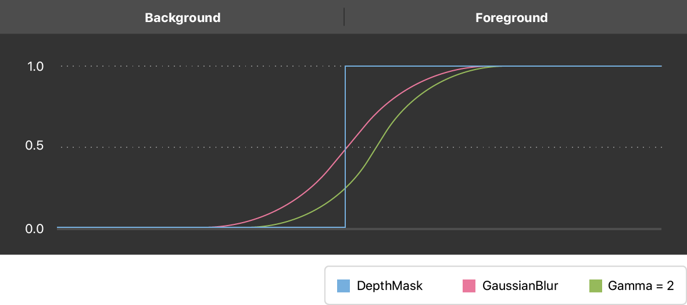

# Enhancing Live Video by Leveraging TrueDepth Camera Data

Apply your own background to a live capture feed streamed from the front-facing TrueDepth camera.

## Overview

The TrueDepth camera provides real-time depth data that allows you to segment foreground from background in a video feed.

This sample app leverages depth data to dynamically replace the entire background with a custom image. It then performs Gaussian filtering and other image processing operations to remove holes and smooth the effect.

## Preview the Sample App

To see this sample app in action, build and run the project in Xcode on a device running iOS 11 or later. Because Xcode doesn’t have access to the TrueDepth camera, this sample won't work in the Xcode simulator.

The sample app begins by removing the background, replacing it with black. Apply your own image from the camera roll by swiping down anywhere on the video feed.

## Set Up Live Capture from the TrueDepth Camera

Set up an [`AVCaptureSession`](https://developer.apple.com/documentation/avfoundation/avcapturesession) on a separate thread via the session queue. Initialize this session queue before configuring the camera for capture.

``` swift
// Communicate with the session and other session objects on this queue.
private let sessionQueue = DispatchQueue(label: "session queue", attributes: [], autoreleaseFrequency: .workItem)
```

The [`startRunning`](https://developer.apple.com/documentation/avfoundation/avcapturesession/1388185-startrunning) method is a blocking call which can take a long time. Dispatch session setup to the sessionQueue so the main queue isn’t blocked, allowing the app’s UI to stay responsive.

``` swift
sessionQueue.async {
    self.configureSession()
}
```

Setting up the camera for video capture follows many of the same steps as normal video capture. See [Setting Up a Capture Session](https://developer.apple.com/documentation/avfoundation/cameras_and_media_capture/setting_up_a_capture_session) for details on configuring streaming setup.

On top of normal setup, request depth data by declaring a separate output:

``` swift
private let depthDataOutput = AVCaptureDepthDataOutput()
```

Explicitly add this output type to your capture session:

``` swift
if session.canAddOutput(depthDataOutput) {
    session.addOutput(depthDataOutput)
    depthDataOutput.isFilteringEnabled = true
    if let connection = depthDataOutput.connection(with: .depthData) {
        connection.isEnabled = true
    } else {
        print("No AVCaptureConnection")
    }
} else {
    print("Could not add depth data output to the session")
    setupResult = .configurationFailed
    session.commitConfiguration()
    return
}
```

Search for the highest resolution available with floating-point depth values, and lock the configuration to the format.

``` swift
let depthFormats = videoDevice.activeFormat.supportedDepthDataFormats
let depth32formats = depthFormats.filter({
    CMFormatDescriptionGetMediaSubType($0.formatDescription) == kCVPixelFormatType_DepthFloat32
})
if depth32formats.isEmpty {
    print("Device does not support Float32 depth format")
    setupResult = .configurationFailed
    session.commitConfiguration()
    return
}

let selectedFormat = depth32formats.max(by: { first, second in
    CMVideoFormatDescriptionGetDimensions(first.formatDescription).width <
        CMVideoFormatDescriptionGetDimensions(second.formatDescription).width })
```

Synchronize the normal RGB video data with depth data output. The first output in the dataOutputs array is the master output.

``` swift
outputSynchronizer = AVCaptureDataOutputSynchronizer(dataOutputs: [videoDataOutput, depthDataOutput, metadataOutput])
outputSynchronizer!.setDelegate(self, queue: dataOutputQueue)
```

## Create a Binary Foreground Mask

Assume the foreground to be a human face. You can accomplish face detection through the Vision framework’s [`VNDetectFaceRectanglesRequest`](https://developer.apple.com/documentation/vision/vndetectfacerectanglesrequest), but this sample doesn’t need anything else from Vision, so it’s simpler to consult the [`AVMetadataObject`](https://developer.apple.com/documentation/avfoundation/avmetadataobject) for [`ObjectType.face`](https://developer.apple.com/documentation/avfoundation/avmetadataobject/objecttype/1385845-face). 

``` swift
self.session.addOutput(metadataOutput)
if metadataOutput.availableMetadataObjectTypes.contains(.face) {
    metadataOutput.metadataObjectTypes = [.face]
}
```

Using the [`AVMetadataObject`](https://developer.apple.com/documentation/avfoundation/avmetadataobject), locate the face’s bounding box and center. Assume there is only one face and take the first one in the metadata object.

``` swift
if let syncedMetaData: AVCaptureSynchronizedMetadataObjectData =
    synchronizedDataCollection.synchronizedData(for: metadataOutput) as? AVCaptureSynchronizedMetadataObjectData,
    let firstFace = syncedMetaData.metadataObjects.first,
    let connection = self.videoDataOutput.connection(with: AVMediaType.video),
    let face = videoDataOutput.transformedMetadataObject(for: firstFace, connection: connection) {
    let faceCenter = CGPoint(x: face.bounds.midX, y: face.bounds.midY)
```

Depth maps differ from their normal camera image counterparts in resolution; as a result, normal image coordinates differ from depth map coordinates by a scale factor. Compute the scale factor and transform the face’s center to depth map coordinates.

``` swift
let scaleFactor = CGFloat(CVPixelBufferGetWidth(depthPixelBuffer)) / CGFloat(CVPixelBufferGetWidth(videoPixelBuffer))
let pixelX = Int((faceCenter.x * scaleFactor).rounded())
let pixelY = Int((faceCenter.y * scaleFactor).rounded())
```

Once you have the face in depth map coordinates, threshold the image to create a binary mask image, where the foreground pixels are `1`, and the background pixels are `0`.

``` swift
let depthWidth = CVPixelBufferGetWidth(depthPixelBuffer)
let depthHeight = CVPixelBufferGetHeight(depthPixelBuffer)

CVPixelBufferLockBaseAddress(depthPixelBuffer, CVPixelBufferLockFlags(rawValue: 0))

for yMap in 0 ..< depthHeight {
    let rowData = CVPixelBufferGetBaseAddress(depthPixelBuffer)! + yMap * CVPixelBufferGetBytesPerRow(depthPixelBuffer)
    let data = UnsafeMutableBufferPointer<Float32>(start: rowData.assumingMemoryBound(to: Float32.self), count: depthWidth)
    for index in 0 ..< depthWidth {
        if data[index] > 0 && data[index] <= depthCutOff {
            data[index] = 1.0
        } else {
            data[index] = 0.0
        }
    }
}
```

## Smooth the Depth Mask with Core Image Filters

The depth map doesn’t share the RGB image’s sharp resolution, so the mask may contain holes along the interface between foreground and background. Once you have a downsampled mask image, use a Gaussian filter to smooth out the holes, so the interface doesn’t look jagged or pixelated. Clamp your image before filtering it, and crop it afterward, so it retains the proper size when applied with the original image.

``` swift
let depthMaskImage = CIImage(cvPixelBuffer: depthPixelBuffer, options: [:])

// Smooth edges to create an alpha matte, then upscale it to the RGB resolution.
let alphaUpscaleFactor = Float(CVPixelBufferGetWidth(videoPixelBuffer)) / Float(depthWidth)
let alphaMatte = depthMaskImage.clampedToExtent()
    .applyingFilter("CIGaussianBlur", parameters: ["inputRadius": blurRadius])
    .applyingFilter("CIGammaAdjust", parameters: ["inputPower": gamma])
    .cropped(to: depthMaskImage.extent)
    .applyingFilter("CIBicubicScaleTransform", parameters: ["inputScale": alphaUpscaleFactor])
```

The parameters of your `CIGaussianBlur` and `CIGammaAdjust` filters directly affect the smoothness of the edge pixels. You can tune the blur and smoothness by adjusting the Gaussian blur filter’s input radius, as well as the gamma adjustment filter’s input power.



## Blend Foreground and Background with the Alpha Matte

The final step is applying your filtered smooth binary mask to the input video frame.

Because you've performed image processing in Core Image using the `CIGaussianBlur` and `CIGammaAdjust` filters, it's most computationally efficient to apply the resulting mask in Core Image, as well. That means converting your video from [`CVPixelBuffer`](https://developer.apple.com/documentation/corevideo/cvpixelbuffer-q2e) format to [`CIImage`](https://developer.apple.com/documentation/coreimage/ciimage) format, allowing you to apply the alpha matte to the original image, and blend in your custom background image with the `CIBlendWithMask` filter.

``` swift
let image = CIImage(cvPixelBuffer: videoPixelBuffer)

// Apply alpha matte to the video.
var parameters = ["inputMaskImage": alphaMatte]
if let background = self.backgroundImage {
    parameters["inputBackgroundImage"] = background
}

let output = image.applyingFilter("CIBlendWithMask", parameters: parameters)
```

Update your preview to display the final composited image onscreen.

``` swift
previewView.image = output
```
